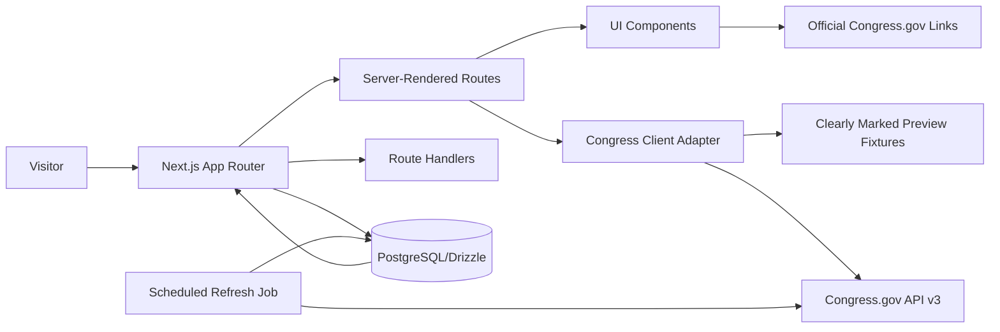

# Civic Ledger Architecture

## Goal

Give people a fast, plain-English path into congressional records while preserving primary-source provenance and 
leaving room for editorial learning content.

## Boundaries

| Layer              | Responsibility                                  | Rule                                                              |
|--------------------|-------------------------------------------------|-------------------------------------------------------------------|
| `src/app`          | Routes, metadata, route handlers                | Never expose the government API key.                              |
| `src/components`   | Presentation and small user interactions        | Preserve visible preview/live provenance.                         |
| `src/db`           | User-owned data and future normalized snapshots | Do not claim it is the source of truth for congressional records. |
| `src/lib/congress` | Fetch, normalize, cache, and classify API data  | Treat upstream fields as untrusted and maintain one stable model. |
| `src/lib/glossary` | Curated editorial learning content              | Cite sources once lessons become long-form.                       |

## Runtime Data Flow

1. A Next.js server route calls `getCongressSnapshot`.
2. If a server-only key exists, the adapter requests `https://api.congress.gov/v3/bill?format=json` and lets Next
   cache the result for five minutes.
3. The adapter maps only known fields into `LegislativeBill`, which keeps the rest of the app insulated from
   upstream changes.
4. If no key exists or the request fails, the app renders transparent preview data instead of a broken dashboard.
5. A user can always leave for the official record from a bill page.

## Persistence Plan

The draft includes only the tables needed for a future "saved bill" experience. When a database is provisioned, add:

- `congressional_records`: normalized upstream records with `source_updated_at`, `fetched_at`, raw-response hash,
  and provider URL.
- `record_events`: append-only action/timeline data.
- `sync_runs`: data freshness, error, and quota observability.
- `saved_bills`: already sketched for authenticated user collections.

Start with on-demand reads plus cache. Move to scheduled, incremental synchronization after usage requires reliable
history, notification delivery, or more than a few API-facing features.

## Deployment

- **App:** Vercel or any Node-capable platform running Next.js 16.
- **Database:** managed PostgreSQL (Neon is a natural fit) when user-owned persistence begins.
- **Jobs:** Vercel Cron plus a durable queue/workflow provider only when syncs or notifications become multistep.
- **Observability:** add structured logs, Sentry, and OpenTelemetry before public launch.
- **Secrets:** deployment environment variables only; never commit `.env.local`.

## Security and Accessibility Baseline

- API key stays server-side and is excluded from Git.
- No political-affiliation targeting or persuasion logic belongs in the product.
- Components retain keyboard focus styles, semantic landmarks, accessible form labels, contrast-conscious colors,
  and real links.
- Preview/fallback content is visibly labeled to avoid accidental misinformation.
