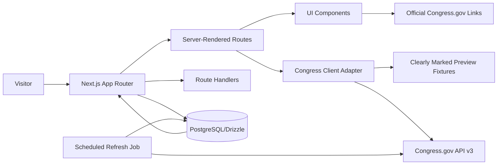

# Civic Ledger Architecture

## Goal

Give people a fast, plain-English path into congressional records while preserving primary-source provenance and leaving
room for editorial learning content.

```mermaid
flowchart LR
    V[Visitor] --> N[Next.js App Router]
    N --> P[Server-Rendered Routes]
    N --> R[Route Handlers]
    P --> C[Congress Client Adapter]
    C --> A[Congress.gov API v3]
    C --> F[Clearly Marked Preview Fixtures]
    P --> U[UI Components]
    U --> O[Official Congress.gov Links]
    N --> D[(PostgreSQL/Drizzle)]
    J[Scheduled Refresh Job] --> A
    J --> D
    D --> N
```

## Boundaries

| Layer                                              | Responsibility                                  | Rule                                                              |
|----------------------------------------------------|-------------------------------------------------|-------------------------------------------------------------------|
| `src/app`                                          | Routes, metadata, route handlers                | Never expose the government API key.                              |
| `src/components`                                   | Presentation and small user interactions        | Preserve visible preview/live provenance.                         |
| `src/hooks`                                        | Client-side async behavior extracted from views | Depend only on isomorphic modules, never on the server adapter.   |
| `src/db`                                           | User-owned data and future normalized snapshots | Do not claim it is the source of truth for congressional records. |
| `src/lib/api-query.ts`                             | Validation of this app's own query params       | Parse, don't trust; every input resolves to a usable value.       |
| `src/lib/search-params.ts`                         | Resolving each directory's deep link            | Server-only; a stale link degrades to the default view.           |
| `src/lib/congress`                                 | Fetch, normalize, cache, and classify API data  | Treat upstream fields as untrusted and maintain one stable model. |
| `src/lib/congress/seating.ts`                      | Chart geometry only                             | Stay free of React and of any Congress.gov concern.               |
| `src/lib/bill-route.ts`, `src/lib/member-route.ts` | In-app route construction                       | One definition per route shape; never build a route inline.       |
| `src/lib/glossary.ts`                              | Curated editorial learning content              | Cite sources once lessons become long-form.                       |

### Inside the Congress Adapter

`src/lib/congress/client.ts` is a barrel, not an implementation: it re-exports the adapter's public surface so routes,
components, and tests import one stable path while the internals stay free to move.

| Module                   | Responsibility                                                                |
|--------------------------|-------------------------------------------------------------------------------|
| `api-schema.ts`          | Zod shapes for Congress.gov v3 payloads — the untrusted-input boundary.       |
| `http.ts`                | Key access, URL building, caching policy, one request helper, route guards.   |
| `mappers.ts`             | Upstream shapes into this app's stable model. Pure; performs no I/O.          |
| `bills.ts`               | Bill snapshots, pagination, lookup, summaries, text versions, search.         |
| `composition.ts`         | Chamber membership, including the member list's pagination.                   |
| `member-directory.ts`    | The same membership, reshaped into one browsable alphabetical roster.         |
| `member-filter.ts`       | The directory's narrowing, ordering, and URL rules. Pure and isomorphic.      |
| `member-profile.ts`      | One member's own record, plus the legislation they sponsored and cosponsored. |
| `committees.ts`          | The committee model: chambers, types, shapes, display helpers. Pure; no I/O.  |
| `committee-directory.ts` | Every committee of a Congress, reshaped into one browsable list.              |
| `committee-filter.ts`    | That directory's narrowing, ordering, and URL rules. Pure and isomorphic.     |
| `committee-profile.ts`   | One committee's record, its name history, and its subcommittees.              |
| `client.ts`              | Public surface. Re-exports only.                                              |

Two invariants hold across every exported read:

1. **Nothing throws.** Upstream failure is an expected condition, not an exception — a page degrades to clearly labeled
   preview data, never to an error boundary.
2. **Provenance travels with the data.** Anything that can come from either live or preview data reports which it was,
   on the same returned value, so no caller can render one while claiming the other.

Payloads are validated at runtime rather than cast. Schemas are loose objects whose fields each `.catch(undefined)`, so
an unexpected field type degrades that one field — which the mappers already handle — instead of discarding a whole
page. Only a payload that isn't an object at all is rejected outright.

## Runtime Data Flow

1. A Next.js server route calls `getCongressSnapshot` (current Congress) or `getCongressSnapshotForCongress` (any other
   Congress `/bills/[congress]` supports — see `src/lib/congress/congress-history.ts` for the supported range). The
   former is a thin wrapper around the latter, so both share one fetch and one fallback policy. The home route
   additionally calls `getCongressComposition` for the chamber diagram, concurrently rather than in sequence; the two
   datasets carry independent provenance and fall back independently.
2. If a server-only key exists, the adapter requests `https://api.congress.gov/v3/bill/{congress}?format=json` and lets
   Next cache the result for five minutes.
3. The adapter maps only known fields into `LegislativeBill`, which keeps the rest of the app insulated from upstream
   changes.
4. If no key exists or the request fails, the app renders transparent preview data instead of a broken dashboard.
5. A user can always leave for the official record: from a bill page to its public Congress.gov record (derived from the
   bill's identity by `congressGovBillUrl` — the upstream `url` field is an API self-link, not a readable page), and
   from any member's page to their entry in the Biographical Directory. Seats in the chamber diagram and sponsor lines
   on bill pages both link inward first, to that member's own page, which carries the outbound link onward.

Membership follows the same path with one wrinkle: `/v3/member/congress/{congress}` is paginated at the API's 250-record
ceiling, so `getCongressComposition` (in `composition.ts`) reads `pagination.count` from the first page and then
requests the remainder in parallel. Chart geometry is computed separately, in a pure module
(`src/lib/congress/seating.ts`) that knows nothing about Congress.gov — see "The Chamber Diagram Is a Schematic" in
`docs/decisions.md`.

The member directory (`/members`) is not a fourth endpoint. `getMemberDirectory` (in `member-directory.ts`) calls the
same `getCongressComposition` the chamber diagram does, so the two share one cached fetch inside the five-minute window
and cannot disagree about who is serving; what it adds is reshaping — flattening both chambers into one alphabetical
list, carrying `chamber` down onto each row (a flat list no longer has a grouping to imply it), and dropping any member
whose record carries no Bioguide ID, since a directory row that opens nothing is dead weight. Narrowing then happens
entirely in the browser against `member-filter.ts`, which is pure and imports no server module — see "The Member
Directory Filters in the Browser" in `docs/decisions.md`.

Both directories mirror their current view into the address bar, so a search, a set of facets, or a chosen order can be
linked and bookmarked (`/members?chamber=senate&sort=state`, `/bills?q=broadband&stage=law`). Each one's URL spelling
lives beside its rules rather than in its route — `MEMBER_DIRECTORY_PARAMS`/`memberDirectoryQueryString` in
`member-filter.ts`, `BILL_DIRECTORY_PARAMS`/`billDirectoryQueryString` in `search.ts` — because those names cross a
boundary the server and the browser both write to. `src/lib/search-params.ts` is the server half: it reads the request
and resolves a starting view, so a shared link renders already narrowed on its first paint rather than flashing the
full list. The browser half writes with `history.replaceState` rather than a router navigation, since the URL is
recording client state rather than requesting a render — see "A Narrowed Directory Is a Place, So It Has a URL" in
`docs/decisions.md`.

An *individual* member (`/members/[bioguideId]`) is a separate read in `member-profile.ts`, against a different
endpoint: `/v3/member/{bioguideId}`, whose item-level record carries the per-term `congress` and `memberType` the list
endpoint omits, plus the portrait and leadership history. It issues three requests concurrently — the member, their
sponsored legislation, and their cosponsored legislation — and a failure in either legislation list still yields a page,
because the profile is the substance of it. The route param is narrowed by `normalizeBioguideId` before it is
interpolated into any URL, on the same "validate the shape, never escape" rule as `normalizeBillRouteParams`; an ID
that fails the guard is resolved against the preview fixtures rather than sent upstream.

## Persistence Plan

The draft includes only the tables needed for a future "saved bill" experience. When a database is provisioned, add:

- `congressional_records`: normalized upstream records with `source_updated_at`, `fetched_at`, raw-response hash, and
  provider URL.
- `record_events`: append-only action/timeline data.
- `sync_runs`: data freshness, error, and quota observability.
- `saved_bills`: already sketched for authenticated user collections.

Start with on-demand reads plus cache. Move to scheduled, incremental synchronization after usage requires reliable
history, notification delivery, or more than a few API-facing features.

## Deployment

- **App:** Vercel or any Node-capable platform running Next.js 16.
- **Database:** managed PostgreSQL (Neon is a natural fit) when user-owned persistence begins.
- **Jobs:** Vercel Cron plus a durable queue/workflow provider only when syncs or notifications become multistep.
- **Observability:** add structured logs, Sentry, and OpenTelemetry before public launch.
- **Secrets:** deployment environment variables only; never commit `.env.local`.

## Security and Accessibility Baseline

- API key stays server-side and is excluded from Git. It is read only through `getCongressApiKey()`, which treats an
  empty or whitespace-only value as absent rather than sending a blank key upstream.
- Every dynamic path segment is validated against a closed format before it reaches an outbound Congress.gov URL
  (`normalizeBillRouteParams`), and this app's own query params are parsed rather than coerced (`src/lib/api-query.ts`,
  `src/lib/search-params.ts`). None of the directory's own query params is ever interpolated into an upstream request;
  they only ever select among values already in hand.
- Upstream payloads are validated at runtime, not cast.
- No political-affiliation targeting or persuasion logic belongs in the product.
- Components retain keyboard focus styles, semantic landmarks, accessible form labels, contrast-conscious colors, and
  real links.
- Every page begins with a skip link to the `<main>` landmark, which takes `tabIndex={-1}` so the jump actually moves
  focus rather than only scrolling. The header's search form is a `search` landmark in its own right.
- Links that open a new tab say so in their accessible name (`ExternalLinkHint`); the external-link glyph beside them is
  decorative and `aria-hidden`, so on its own it told a screen-reader user nothing.
- The member directory's sort control reorders the grid in place rather than navigating, so it needs no WCAG 3.2.2
  advisory — but the chosen order is named in the result-count line, which is a live region, so a reorder is announced
  rather than only visible.
- The Congress picker navigates on selection, and its label says so before it is used — the advisory that WCAG 3.2.2
  (On Input) requires for that pattern. It also ignores a selection matching the Congress already shown, so arrowing
  through the list on browsers that fire `change` per option doesn't walk the reader through pages they never chose.
- Nothing is reachable by pointer alone. The chamber diagram in particular is fully keyboard-operable (one tab stop plus
  a roving tabindex across seats) and names every seat for assistive technology, so it reads as a list of members rather
  than an unlabeled picture. Party color is never the only carrier of meaning — each seat states its party in its
  accessible name and the legend spells out every party and count in text.
- Preview/fallback content is visibly labeled to avoid accidental misinformation.
