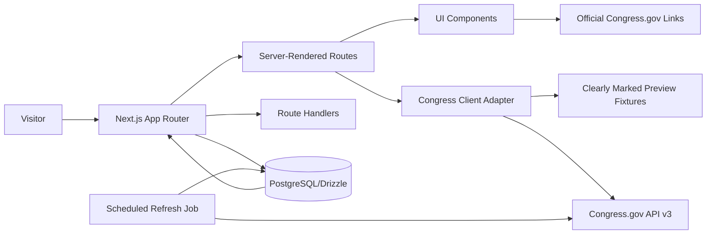

# Architecture

## Goal

Give people a fast, plain-English path into congressional records while preserving primary-source provenance and leaving
room for editorial learning content.

What that goal rules out is as load-bearing as what it rules in — see [Data Policy](data-policy.md) for the claims this
app makes and refuses to make. This document covers the shape: boundaries, data flow, and where things are allowed to
depend on each other.

## Scope

The product covers bills and their legislative path, members, and committees. Congress.gov offers far more collections —
nominations, treaties, roll-call votes, the *Congressional Record* — but a broad clone would be harder to understand and
more expensive to keep fresh than a focused surface is. Those are future verticals, not omissions; see
[Roadmap](roadmap.md).

A collection being out of scope does not make it out of bounds for the `/learn` modules: `/learn/how-congress-votes`
explains roll-call votes and then says outright that this app holds none, linking the two chambers' own tallies. The
rule that keeps that honest rather than misleading is in
[Editorial Content Cites Its Sources](data-policy.md#editorial-content-cites-its-sources).

```mermaid
flowchart LR
    V[Visitor] --> N[Next.js App Router]
    N --> P[Server-Rendered Routes]
    N --> R[Route Handlers]
    P --> C[Congress Client Adapter]
    C --> A[Congress.gov API v3]
    C --> F[Clearly Marked Preview Fixtures]
    P --> U[UI Components]
    U --> O[Official Congress.gov Links]
    N --> D[(PostgreSQL/Drizzle)]
    J[Scheduled Refresh Job] --> A
    J --> D
    D --> N
```

Everything upstream is reached through one server-side adapter rather than from the browser. That is first a secrecy
requirement — a Congress.gov key travels in the request URL, so a browser request is a published key — and second a
consistency one: the adapter gives the whole UI one stable type, one caching policy, and one fallback policy.

## Boundaries

| Layer                         | Responsibility                                        | Rule                                                              |
|-------------------------------|-------------------------------------------------------|-------------------------------------------------------------------|
| `src/app`                     | Routes, metadata, route handlers                      | Never expose the government API key.                              |
| `src/components`              | Presentation and small user interactions              | Preserve visible preview/live provenance.                         |
| `src/db`                      | User-owned data and future normalized snapshots       | Do not claim it is the source of truth for congressional records. |
| `src/hooks`                   | Client-side behavior extracted from views             | Depend only on isomorphic modules, never on the server adapter.   |
| `src/lib/api-query.ts`        | Validation of this app's own query params             | Parse, don't trust; every input resolves to a usable value.       |
| `src/lib/*-route.ts`          | In-app route construction                             | One definition per route shape; never build a route inline.       |
| `src/lib/format.ts`           | Shared display and comparison rules                   | One collator and one date order for the whole app.                |
| `src/lib/glossary.ts`         | Curated editorial vocabulary, and finding it in prose | Cover every term the lessons lean on; annotate, never rewrite.    |
| `src/lib/lessons.ts`          | Curated editorial learning content                    | Cite primary sources; state what each lesson leaves out.          |
| `src/lib/metadata.ts`         | How a page names itself to crawlers and shares        | One call per page; compose share tags, never assume inheritance.  |
| `src/lib/search-params.ts`    | Resolving each directory's deep link                  | Server-only; a stale link degrades to the default view.           |
| `src/lib/congress`            | Fetch, normalize, cache, and classify API data        | Treat upstream fields as untrusted and maintain one stable model. |
| `src/lib/congress/seating.ts` | Chart geometry only                                   | Stay free of React and of any Congress.gov concern.               |

### Inside the Congress Adapter

`src/lib/congress/client.ts` is a barrel, not an implementation: it re-exports the adapter's public surface so routes,
components, and tests import one stable path while the internals stay free to move.

| Module                   | Responsibility                                                                |
|--------------------------|-------------------------------------------------------------------------------|
| `api-schema.ts`          | Zod shapes for Congress.gov v3 payloads — the untrusted-input boundary.       |
| `http.ts`                | Key access, URL building, caching policy, one request helper, route guards.   |
| `mappers.ts`             | Upstream shapes into this app's stable model. Pure; performs no I/O.          |
| `bills.ts`               | Bill snapshots, pagination, lookup, summaries, text, actions, search.         |
| `composition.ts`         | Chamber membership, including the member list's pagination.                   |
| `member-directory.ts`    | The same membership, reshaped into one browsable alphabetical roster.         |
| `member-filter.ts`       | The directory's narrowing, ordering, and URL rules. Pure and isomorphic.      |
| `member-profile.ts`      | One member's own record, plus the legislation they sponsored and cosponsored. |
| `committees.ts`          | The committee model: chambers, types, shapes, display helpers. Pure; no I/O.  |
| `committee-directory.ts` | Every committee of a Congress, reshaped into one browsable list.              |
| `committee-filter.ts`    | That directory's narrowing, ordering, and URL rules. Pure and isomorphic.     |
| `committee-profile.ts`   | One committee's record, its name history, and its subcommittees.              |
| `committee-records.ts`   | The bills/reports/nominations model, paging, and URL rules. Pure; no I/O.     |
| `committee-activity.ts`  | One page of one of those collections, plus the referred bills' titles.        |
| `directory-filter.ts`    | The vocabulary all three directories narrow with. Pure and isomorphic.        |
| `search.ts`              | The bill directory's matching, citation parsing, and URL rules. Pure.         |
| `stage.ts`               | The stage cue: from action codes where fetched, from prose otherwise.         |
| `sanitize-summary.ts`    | The allow-listed CRS summary sanitizer. Builds output; never patches input.   |
| `client.ts`              | Public surface. Re-exports only.                                              |

Two invariants hold across every exported read:

1. **Nothing throws.** Upstream failure is an expected condition, not an exception — a page degrades to clearly labeled
   preview data, never to an error boundary.
2. **Provenance travels with the data.** Anything that can come from either live or preview data reports which it was,
   on the same returned value, so no caller can render one while claiming the other.

Payloads are validated at runtime rather than cast. Schemas are loose objects whose fields each `.catch(undefined)`, so
an unexpected field type degrades that one field — which the mappers already handle — instead of discarding a whole
page. Only a payload that isn't an object at all is rejected outright.

## Runtime Data Flow

1. A Next.js server route calls `getCongressSnapshot` (current Congress) or `getCongressSnapshotForCongress` (any other
   Congress `/bills/[congress]` supports). The former is a thin wrapper around the latter, so both share one fetch and
   one fallback policy. The home route additionally calls `getCongressComposition` for the chamber diagram, concurrently
   rather than in sequence; the two datasets carry independent provenance and fall back independently.
2. If a server-only key exists, the adapter requests `https://api.congress.gov/v3/bill/{congress}?format=json` and lets
   Next cache the result for five minutes. Every request is bounded by `REQUEST_TIMEOUT_MS`, so a stalled connection
   becomes an ordinary `failed` outcome — and therefore a labeled fallback — instead of a page that never finishes
   rendering. That bound matters most in the search sweep, which awaits one request per supported Congress at once.
3. The adapter maps only known fields into `LegislativeBill`, which keeps the rest of the app insulated from upstream
   changes.
4. If no key exists or the request fails, the app renders transparent preview data instead of a broken dashboard.
5. A reader can always leave for the official record: from a bill page to its public Congress.gov record, and from any
   member's page to their entry in the Biographical Directory. Seats in the chamber diagram and sponsor lines on bill
   pages both link *inward* first, to that member's own page, which carries the outbound link onward.

Point 5 is a deliberate reversal. Both of those used to point straight out to the Biographical Directory, which answers
"who is this person" but not "what else have they introduced," and takes the reader off the site to do it. Nothing is
lost by linking inward: the member page carries the official-biography link onward, alongside the member's own
house.gov/senate.gov site when the record has one. The route is keyed on the Bioguide ID because it is already unique
and, unlike a name slug, never changes.

### Membership

`/v3/member/congress/{congress}` is paginated at the API's 250-record ceiling, so `getCongressComposition` (in
`composition.ts`) reads `pagination.count` from the first page and then requests the remainder in parallel. Chart
geometry is computed separately, in a pure module (`src/lib/congress/seating.ts`) that knows nothing about
Congress.gov — see [Data Policy](data-policy.md#what-the-chamber-diagram-claims) for what the resulting picture does and
does not assert.

Seats are distributed across arcs in proportion to each arc's radius using the largest-remainder method, which is what
guarantees the drawn seats sum to exactly the membership. A round-and-hope split drifts by a seat or two, and in a
chamber diagram a drifted seat is either an unseated member or an empty chair nobody voted for. Keeping the arithmetic
in a pure module is what makes "every member gets exactly one seat, no two seats overlap, nothing escapes the viewBox"
directly testable.

**The member directory is not a fourth endpoint.** `getMemberDirectory` (in `member-directory.ts`) calls the same
`getCongressComposition` the chamber diagram does, on the same cache tag and five-minute window. Two things follow, and
both were the point:

- **It costs nothing extra upstream.** Within the cache window, a visitor who lands on the home page and then opens
  `/members` makes no additional Congress.gov requests at all. Adding a page did not add a quota cost.
- **The two views cannot disagree.** A separate fetch could return a different roster on either side of a membership
  change, and "the diagram shows 435 seats but the directory lists 434 people" is exactly the kind of quiet
  inconsistency that erodes trust in a source-provenance product.

What the directory adds is reshaping: flattening both chambers into one alphabetical list, carrying `chamber` down onto
each row (a flat list no longer has a grouping to imply it), and dropping any member whose record carries no Bioguide
ID, since a directory row that opens nothing is dead weight. That last rule is what makes the preview path a genuinely
separate branch — every placeholder seat is unattributed and ID-less, so a preview directory built from the composition
would be empty. It is built from `previewMemberProfiles` instead.

### Individual Records

An *individual* member (`/members/[bioguideId]`) is a separate read in `member-profile.ts`, against a different
endpoint: `/v3/member/{bioguideId}`, whose item-level record carries the per-term `congress` and `memberType` the list
endpoint omits, plus the portrait and leadership history. It issues three requests concurrently — the member, their
sponsored legislation, and their cosponsored legislation — and a failure in either legislation list still yields a page,
because the profile is the substance of it.

The route param is narrowed by `normalizeBioguideId` before it is interpolated into any URL, on the same "validate the
shape, never escape" rule as `normalizeBillRouteParams`; an ID that fails the guard is resolved against the preview
fixtures rather than sent upstream.

### A Committee's Own Records

An individual committee page reads more than the committee: `committee-activity.ts` fetches one page of one of the three
collections Congress.gov counts alongside it (`/bills`, `/reports`, `/nominations`), selected and paged by the page's
own query params. The pure half — the model, the paging arithmetic, and the URL spelling — is `committee-records.ts`,
split from the fetcher on exactly the `committee-directory.ts`/`committee-filter.ts` line.

Three things about this are worth knowing before changing it.

**The three endpoints are three shapes, not one parameterized path.** `/bills` nests its array under a hyphenated
`committee-bills` key and reports its count in two places; the other two return theirs at the top level. What the three
fetchers *do* share is stated once: the paging arithmetic, the cache tags, and the rule that a 404 is an empty
collection while a transport failure is not. That last distinction is why `CommitteeRecordsResult` carries
`unavailable` — a committee with no reports and a committee whose reports could not be fetched both render zero rows,
and reporting the first when the truth is the second would be a false claim about the congressional record.

**The page is clamped before the request, not after.** A `?page=` is only meaningful against a collection whose length
is known, so the committee's profile resolves first and its counts hold the requested page inside the collection that
exists. That is the one reason the two reads are sequential rather than concurrent: the alternative is spending a round
trip to discover that a link overshot.

**This is the one read in the adapter that costs more than a bounded handful of requests, and it is a deliberate
trade.** The committee-bills endpoint publishes a congress, a type, a number, a relationship, and a date, and *no
title*. A list reading "H.R. 10000 · Referred To · July 30, 2026" says which measures a committee handled and nothing
about what they were, which for a product whose stated purpose is legibility is close to no feature at all. So each page
issues one bill lookup per row on screen — never per record in the collection, so a committee with ten thousand
referrals costs what one with twelve does — concurrently, on the bill's own cache tags, which it shares with that bill's
own page. A failed lookup costs the title and nothing else: the row still names the measure, still says what the
committee did with it, and still links to it, because the link is built from the identifier rather than from the title.

What the page deliberately does *not* claim about these collections is in
[Data Policy](data-policy.md#a-committees-records-are-paged-in-congressgovs-order-not-in-time).

## The Three Directories

`/bills`, `/members`, and `/committees` are meant to be the same page in three subjects. That sameness is held
structurally rather than by convention, in four separate places:

- **Vocabulary** — `src/lib/congress/directory-filter.ts`: the `ANY_FACET` sentinel, the facet-option shape, the
  query-length cap, and the one total-parser rule every facet and sort param resolves through.
- **Markup** — `src/components/directory-controls.tsx`: search field, segmented filter, facet dropdown, sort control,
  "Clear Filters", and the result-count line.
- **Styling** — `src/styles/directory.css`: `.directory-search`, `.segmented-filter`, `.directory-facet*`, and
  `.directory-result-count`. These are named for the surface rather than for one of its three subjects, so a committee's
  type dropdown is not wearing a class named after members.
- **URL behavior** — `useDirectoryUrlSync`: the two-way reconciliation described below.

What each directory keeps for itself is what a view *means* — its param names, its facets, its orders, its comparators.
A generic "filters" abstraction spanning one directory's three facets, another's two, and a third's one would fit worse
than three explicit declarations and would make each directory harder to read in order to make them look alike.

### Bills Search on the Server; Members and Committees Filter in the Browser

This is deliberate, and the asymmetry is the interesting part. Bills number in the hundreds of thousands and
Congress.gov has no keyword-search parameter, so bill search has to be a debounced request to a server-side sweep. A
Congress is a little over 540 people. That whole roster is already in memory once the composition resolves, and already
being serialized into the page to draw the grid — so it is handed to the browser whole, and every subsequent search,
chamber toggle, party choice, and state selection runs there instantly. No request per keystroke, no debounce, no
loading state, no failure mode when a route handler is unreachable, and nothing to special-case for the static export.

That is why the narrowing rules live in pure, isomorphic modules (`member-filter.ts`, `committee-filter.ts`,
`search.ts`) that import nothing server-side: a client component must be able to import them without dragging the
adapter — and the API key it reads — into the browser bundle. It is also why `src/lib/api-query.ts` keeps a separate
`MAX_QUERY_LENGTH` from the directories' own caps: it is zod-backed and server-oriented, and importing it from an
isomorphic module would pull schema validation into the browser behind it. The dependency runs one way on purpose.

### A Narrowed Directory Is a Place, So It Has a URL

All three directories mirror their current view into the address bar, so a search, a set of facets, or a chosen order
can be linked and bookmarked (`/members?chamber=senate&sort=state`, `/bills?q=broadband&stage=law`,
`/committees?type=standing`). A page that can be arrived at in a state it cannot be left in is a page whose address bar
is lying about where you are.

Each directory's URL spelling lives beside its rules rather than in its route — `MEMBER_DIRECTORY_PARAMS`/
`memberDirectoryQueryString` in `member-filter.ts`, `BILL_DIRECTORY_PARAMS`/`billDirectoryQueryString` in `search.ts`,
and the committee pair in `committee-filter.ts` — because those names cross a boundary the server and the browser both
write to, and a param name typed twice is a link that looks right and restores nothing. Each also has one parser that
*both* sides go through, so a route and a browser can never disagree about what a given link means.

**The server half** is `src/lib/search-params.ts`: it reads the request and resolves a starting view, so a shared link
renders already narrowed on its first paint rather than flashing the full list. It also resolves the one deep link that
is *not* a directory's — an individual committee's record view (`?records=`/`?page=`). That selects among the
collections hanging off a single record rather than narrowing a list of them, but it is the same kind of thing for the
reason that mattered about the others: a committee page showing the third page of its reports is a place, so it needs an
address that brings someone back to it. Its controls are plain links rather than `useDirectoryUrlSync`, because they
navigate — the records behind each live on a different Congress.gov endpoint and are fetched on the server, so there is
no client-side state for a URL to mirror.

**The browser half** is `useDirectoryUrlSync`, which reconciles in *both* directions — writing the URL as the reader
narrows, and following it when something else moves it, such as a soft navigation from the header's own nav link or a
press of Back. A component that only writes the URL silently overwrites every change the router makes: from
`/bills?q=broadband`, clicking "Bills" in the header soft-navigates without remounting the component, which then writes
its stale query string straight back over the URL the router had just set. That state machine — a `lastWritten` ref, a
three-case effect deliberately unkeyed so it can see a soft navigation, and a `popstate` listener — is subtle enough
that it is written once and shared rather than reimplemented per directory.

Two mechanical choices make this cheap:

- **`history.replaceState`, not a router navigation.** `router.replace` re-runs the route on the server. Doing that on
  every keystroke would undo the entire point of a directory that narrows without a request. The URL here is a *record*
  of client state, not an instruction to fetch something, and it is written with the API meant for exactly that.
- **`replace`, not `push`.** Typing seven letters into a search box should not leave seven entries for Back to walk out
  of.

The parsers are total: an absent, malformed, or stale param resolves to a usable default rather than an error. A shared
link is exactly the kind of URL that gets hand-edited, truncated by a chat client, or opened a year later, and none of
those should produce anything worse than the unfiltered page. `?state=` goes one step further and is validated against
the jurisdictions the roster actually contains — matched case-insensitively, so `?state=ohio` resolves to the roster's
own `"Ohio"` — because a value the control has no option for would leave the `<select>` showing one thing while the grid
showed another. That is the specific reason `/members` resolves its URL *after* the roster rather than concurrently.

**What this costs, named honestly:** `/members` used to be prerendered and is now rendered on demand, because a route
that reads `searchParams` has to be. The alternative was reading the params in the browser and keeping the page static,
at the price of every shared link rendering the full roster and then visibly narrowing after hydration — and of the link
doing nothing at all without JavaScript. That trade goes the other way here, for the same reason the header's search is
a real `<form>` rather than a click handler: a link should arrive at what it says it points to, on the first paint,
whatever is or isn't running. The upstream cost is unchanged either way, since the roster still comes through the shared
five-minute cache; what changed is a server render per visit, not a Congress.gov request per visit.

## The Glossary Comes to the Reader

A glossary on its own page is a reference you have to already know you need. `annotateGlossaryTerms` inverts that: it
scans a run of prose, finds the words the glossary defines, and hands back the text as alternating plain and annotated
runs, which `GlossaryProse` renders. A defined word becomes a link to its own entry that shows the definition on hover
and on focus. It is applied where jargon actually lands on a reader — every lesson's steps and limits, and a bill's
latest action, which is the one line on that page written in Congress's voice rather than this app's.

Four decisions are worth knowing before changing it.

**The scan is pure, and its output reproduces its input.** It performs no I/O, imports no React, and concatenating every
returned segment gives back the original string character for character — pinned as a test, because the alternative is a
feature that quietly edits the congressional record in order to decorate it. @see
[A Definition Is Attached to the Record](data-policy.md#a-definition-is-attached-to-the-record-never-merged-into-it).

**Matching tolerates inflection but not derivation.** Terms are stored in title case and met lower-cased, pluralized,
and possessive, so the pattern accepts those and renders whatever the source wrote. It deliberately stops there:
"cosponsorship" is a different claim from "cosponsor", and a stemmer that reached it would attach a definition that
doesn't describe it. Only the *first* mention of each term in a block is annotated, since a paragraph with six dotted
underlines in it is harder to read than the jargon was.

**Which terms a page ships is decided on the server.** `GlossaryProse` is a server component that renders a client one
per match, so a page carries only the entries its own text uses, and prose containing no defined term crosses no client
boundary at all.

**The term is a link before it is a tooltip.** The bubble is an enhancement over an anchor to `/learn#glossary-<term>`,
which is what makes the feature work on a touch screen, with JavaScript off, and for a reader who wants the whole entry.
The far end of that link is `glossaryEntryId`, which the `/learn` page renders as each entry's `id` — one function owns
both ends, so a link and its destination cannot be spelled differently.

## Shared Rules

Two rules are consolidated in `src/lib/format.ts` because a rule that lives in one place is a rule that applies
everywhere, rather than one that applies wherever someone remembered to reach for it.

**`compareText` — one collator.** Alphabetical ordering runs through a locale-pinned `Intl.Collator`, never a bare
`localeCompare`. The server sorts the roster before serializing it and the browser re-sorts the same list;
`localeCompare` uses the *runtime's* locale, and where the two disagree the client-rendered order differs from the
server-rendered one — a hydration mismatch across the whole grid. `"Ødegård"` sorts before `"Zimmerman"` under `en-US`
and after it under `da-DK` or `sv-SE`. No sitting member's name triggers it today, which is exactly the point: the
failure arrives with a new member rather than with a code change, and only for some readers. It matters most in the
seating chart, which is laid out on the server and again in the browser, so a locale disagreement moves ~540 seats.

**`compareIsoDatesDesc` — one date order.** Every date this app sorts on is fixed-width, zero-padded, and
most-significant-field-first, so direct string comparison already *is* chronological order; collating them would cost
more and buy nothing on ASCII digits. Undated records falling last stops being a special case in each caller and becomes
a consequence of the ordering, since an empty string is less than every real timestamp.

Relatedly, a list documented as "most recent first" is sorted, not hoped for. `MemberProfileResult`'s `sponsored` and
`cosponsored` lists go through `compareBillsByRecency` rather than trusting the order Congress.gov returned them in.
Congress.gov does return them newest first, so this was never visibly broken — which is the problem. A promise kept by
an upstream convention breaks silently the day the convention does, on a page where the ordering is the only thing
telling a reader which of a member's bills is recent. The preview path sorts on the same rule, since a fixture's
ordering is no more authoritative than an upstream one.

Normalization happens at the mapping boundary, not at the view, for the same reason. `normalizeJurisdiction` title-cases
the represented state in `mappers.ts` alongside `normalizePartyName` and `type.toUpperCase()`, because the jurisdiction
is the value the member directory's state filter is *keyed on*. If `"NEW YORK"` and `"New York"` ever arrived on
different records, the facet list would offer two New Yorks, each returning half the delegation, and neither would be
wrong from the control's point of view.

## Crawlability

`sitemap.ts` enumerates every supported Congress because that list is *computed* — `listCongresses` derives it from a
fixed constitutional cadence with no I/O — which is what lets the file stay `force-static` and work in the static
export. Every learning module is listed on the same test: `lessons` is a local array, so reading it costs the file none
of the "cheap and reliable" property that keeps individual records out. The route enumerates itself from the same array
in `generateStaticParams`, which is what makes a listed lesson URL and a prerendered lesson page the same set.

Individual member, bill, and committee pages stay out. They are bounded and individually useful, so they look like they
belong; they don't, yet. Knowing who currently holds a seat requires a live Congress.gov request, which would make
sitemap generation depend on an API key and a healthy upstream at build time — a meaningful new failure mode for a file
whose entire job is to be cheaply and reliably generated. Each directory route *is* listed, needs no key to resolve, and
is a single crawlable page that links to every record beneath it, which is what a crawler actually needed. Revisit this
alongside the scheduled-ingestion path below, where a roster will already be on hand locally.

## Persistence Plan

PostgreSQL is deferred, not omitted. There is no value in requiring a database merely to render a public feed, so the
draft includes only the tables needed for a future "saved bill" experience — the first surface for genuinely user-owned
data, which is what Congress.gov has no opinion about. When a database is provisioned, add:

- `congressional_records`: normalized upstream records with `source_updated_at`, `fetched_at`, raw-response hash, and
  provider URL.
- `record_events`: append-only action/timeline data.
- `sync_runs`: data freshness, error, and quota observability.
- `saved_bills`: already sketched for authenticated user collections.

Start with on-demand reads plus cache. Move to scheduled, incremental synchronization only after usage requires reliable
history, notification delivery, or more than a few API-facing features.

## Security Baseline

- The API key stays server-side and is excluded from Git. It is read only through `getCongressApiKey()`, which treats an
  empty or whitespace-only value as absent rather than sending a blank key upstream.
- Every dynamic path segment is validated against a closed format before it reaches an outbound Congress.gov URL
  (`normalizeBillRouteParams`, `normalizeBioguideId`), and this app's own query params are parsed rather than coerced
  (`src/lib/api-query.ts`, `src/lib/search-params.ts`). None of the directories' query params is ever interpolated into
  an upstream request; they only ever select among values already in hand.
- Upstream payloads are validated at runtime, not cast.
- Every upstream request carries a timeout, so a third party that accepts a connection and then stops responding cannot
  hold a server render open indefinitely.
- **The CRS summary sanitizer builds its output rather than patching its input.** An earlier version ran one
  `.replace()` across the raw fragment, rewriting recognized tags and leaving everything else alone — and "everything
  else" was the problem. Given `<img src=x onerror=alert(1)>`, the pattern matched and
  stripped the inner ``, splicing the surviving fragments into a working ``: sanitizing the input
  was what produced the payload. `sanitizeSummaryHtml` now walks the input once and *builds* the output — text between
  recognized tags is escaped, and only an allow-listed tag is re-emitted as markup — which closes the overlapping-tag
  class as a class rather than closing the two payloads that happened to find it. The regression cases beside it are the
  record of which bypasses have been tested; if this is ever pointed at markup from a less predictable source than
  Congress.gov, that reasoning expires and a DOM-based sanitizer is the correct answer.
- No political-affiliation targeting or persuasion logic belongs in the product, and the measurement layer is held to
  the same rule rather than exempted from it — see
  [Analytics Records the Page, Not the Reader](data-policy.md#analytics-records-the-page-not-the-reader).

## Accessibility Baseline

- Components retain keyboard focus styles, semantic landmarks, accessible form labels, contrast-conscious colors, and
  real links.
- Every page begins with a skip link to the `<main>` landmark, which takes `tabIndex={-1}` so the jump actually moves
  focus rather than only scrolling. The header's search form is a `search` landmark in its own right.
- Links that open a new tab say so in their accessible name (`ExternalLinkHint`); the external-link glyph beside them is
  decorative and `aria-hidden`, so on its own it told a screen-reader user nothing.
- **Reordering in place needs announcing, not advising.** The directories' sort controls reorder the grid without
  navigating, so they need no WCAG 3.2.2 advisory — but the chosen order is named in the result-count line, which is a
  live region, so a reorder is announced rather than only visible. It is named only when it isn't the default, so the
  common case stays a plain count.
- **Navigating on selection does need advising.** The Congress picker navigates when a value is chosen, and its label
  says so before it is used — the advisory WCAG 3.2.2 (On Input) requires. It also ignores a selection matching the
  Congress already shown, so arrowing through the list on browsers that fire `change` per option doesn't walk the reader
  through pages they never chose.
- **Every facet option carries its count.** "Ohio (15)" is the difference between a list you can plan a narrowing with
  and one you have to probe. It also does quiet work for the party control, whose order is `partySeatingOrder` — the
  same left-to-right order as the chamber diagram and its legend. That order is only legible *with* the counts;
  reordering the parties by size instead would have made the control disagree with a chart the reader had just looked
  at. States and territories are grouped rather than interleaved, split by `isNonVotingJurisdiction` — the same
  distinction the chamber diagram draws, which makes it a fact about the chamber rather than an editorial grouping.
- **A definition on hover is also a definition on focus, and is dismissible.** The glossary terms in the app's prose
  answer each clause of WCAG 1.4.13 (Content on Hover or Focus) at a named place in `GlossaryTermTip`: the trigger is a
  real link, so focus opens the bubble as hover does; the pointer listeners sit on the wrapper that *contains* the
  bubble, so moving into the definition doesn't dismiss it; Escape closes it, listened for on the document rather than
  on the trigger, since a bubble opened by hovering has no focus inside it to hear a keypress; and nothing closes on a
  timer. The bubble also stays mounted while hidden, because a screen reader resolves `aria-describedby` at the moment
  focus lands — before a bubble mounted by a state update would exist.
- Nothing is reachable by pointer alone. The chamber diagram in particular is fully keyboard-operable (one tab stop plus
  a roving tabindex across seats) and names every seat for assistive technology, so it reads as a list of members rather
  than an unlabeled picture. Party color is never the only carrier of meaning — each seat states its party in its
  accessible name, and the legend spells out every party and count in text.
- Chart seats are real SVG `<a>` elements rather than click handlers, so a seat can be opened in a new tab, copied, or
  followed by a crawler. That costs a full page load instead of client-side navigation — inside `<svg>` React creates
  the anchor in the SVG namespace, where `next/link`'s navigation has nothing to attach to — and behaving like a link
  everywhere is worth more than the transition. `Enter` is consequently left to the browser rather than intercepted,
  since intercepting it would break open-in-new-tab.
- Preview and fallback content is visibly labeled, to avoid accidental misinformation.
